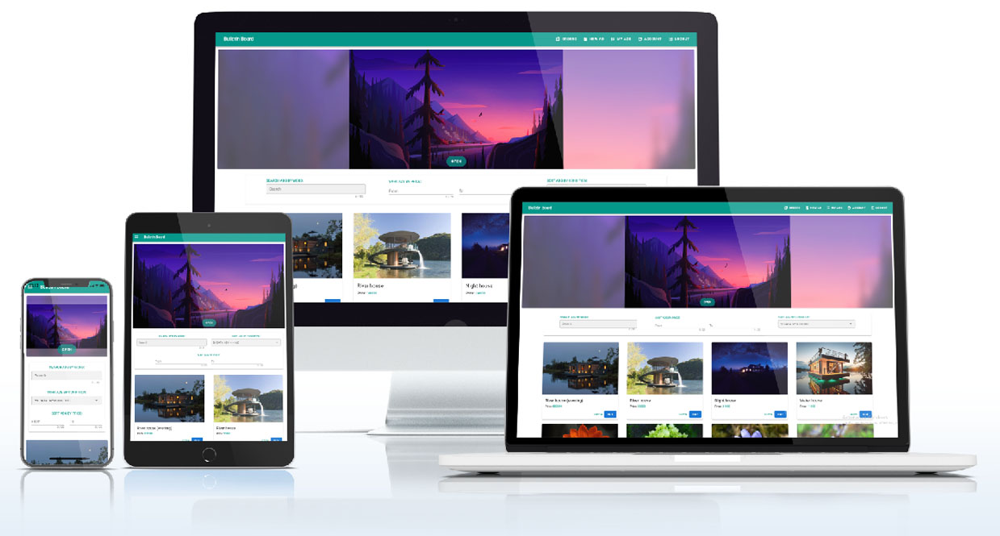

### SPA (доска объявлений) на фреймворке Vue.

## <a href="https://itc-ads-33610.web.app/">Ссылка на SPA</a>

## Bulletin-board SPA

Адаптивное SPA приложение (доска объявлений) на фреймворке Vue. В качестве backend использовался Firebase.

Для проверки работы ЛК и взаимодействия с базой данных, можно войти по паре логин/пароль: ivan@mail.ru/1111Aa. Или создать свой аккаунт (подтверждение почты, отключено)

### При разработке пользовался:

- JavaScript фреймворк Vue
- Централизированное хранилище Vuex
- Компонентный фрейморк для VUE - Vuetify
- WebPack
- Firebase
- CSS фреймворк SASS
